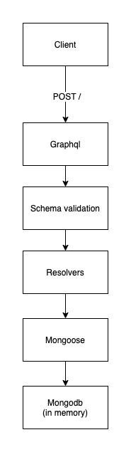

## Live demo

Live demo available here: https://soda-test-willh.herokuapp.com/

## Installing & running

To install run:

```
npm install
```

To run:

```
npm start
```

By default it will run on port 3000, so go to http://localhost:3000/ and the graphql playground will appear

## Queries & mutations

The following queries and mutations are available:

To create an arrival log:

```
mutation createLog(
	$portName: String!
	$vesselName: String!
	$captainName: String!
	$arrivalTime: DateTime!
) {
	createArrivalLog(
		input: {
			portName: $portName
			vesselName: $vesselName
			captainName: $captainName
			arrivalTime: $arrivalTime
		}
	) {
		arrivalTime
		captainName
		vesselName
		portName
	}
}
```

To query for arrival logs:

```
query getLogs($forCaptain: String!) {
	arrivalLogs(forCaptain: $forCaptain) {
		arrivalTime
		captainName
		vesselName
		portName
	}
}
```

The `$forCaptain` filter is optional in the getLogs query allowing you to view all logs.

## Architectural diagram



At the moment for the sake of portability all data is persisted into an in-memory mongodb, this can easily be swapped out for a real mongodb if data persistence is required. The mongodb-memory-server should NOT be used in a production environment and exists in this app to demonstrate functionality easily.
